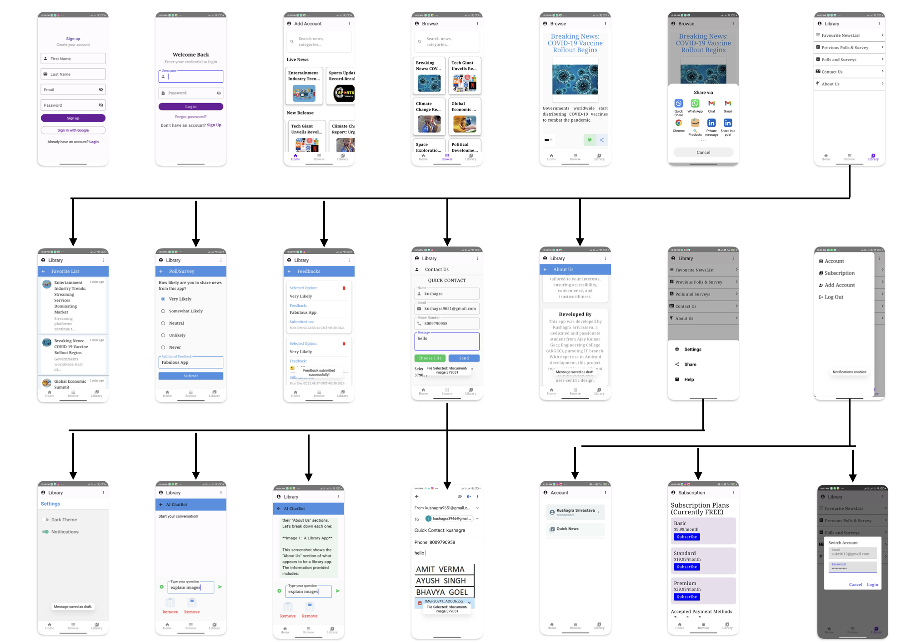

<!-- Project Title -->
<h1 align="center">Quick News</h1>

<!-- Project Description -->
<p align="center">Quick News is an innovative news application that provides real-time updates with AI-powered content analysis and image-based news extraction.</p>

<!-- Badges -->
<p align="center">
  
  
  
</p>

<!-- Table of Contents -->
## Table of Contents

- [Features](#features)
- [Screenshots](#screenshots)
- [Technologies Used](#technologies-used)
- [Setup and Installation](#setup-and-installation)

<!-- Features -->
## Features

- **Real-Time News Updates**: Stay updated with the latest news from various sources.
- **Multi-Lingual Content Analysis**: Understand news in multiple languages with AI-powered analysis.
- **Image-Based News Extraction**: Extract and view news directly from images.
- **Personalized News**: Get news recommendations tailored to your interests.
- **Seamless Sharing**: Share news easily with others.
- **Firebase Integration**: Manage user data efficiently.
- **Gemini AI Integration**: Enhance news extraction with AI capabilities.
- **Improved Accessibility**: Multi-lingual support for a global audience.

<!-- Screenshots -->
## 📸 Screenshots

<p align="center">
  
</p>

---

<!-- Technologies Used -->
## Technologies Used

- **Kotlin**: Programming language for Android development.
- **Retrofit**: HTTP client for API calls.
- **JSON APIs**: For live news updates.
- **Firebase**: User data management.
- **Gemini AI**: Image-based news extraction.
- **Android Jetpack Components**: ViewModel, LiveData, RecyclerView for efficient data handling and UI updates.

<!-- Setup and Installation -->
## Setup and Installation

1. **Clone the repository**:
   ```bash
   git clone https://github.com/kushagraSrivastava9651/Quick-News.git

